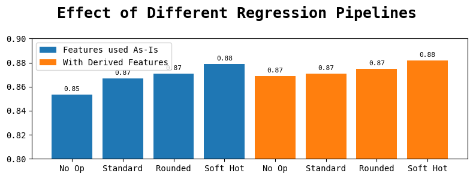
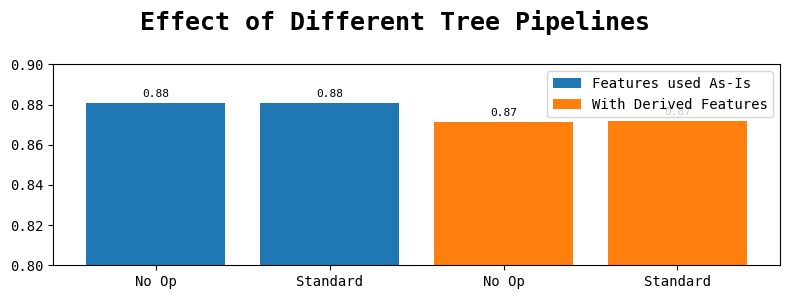
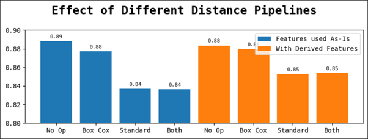
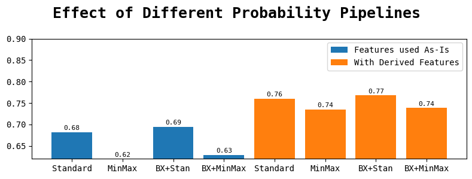

*A Report on*  
**A Comprehensive Study of  
Machine Learning Algorithms  
on Obesity–CVD Risk Dataset**  

*Presented by*  

<table>
<tbody>
<tr>
<td style="text-align: left;"><strong>Shreya Gupta</strong></td>
<td style="text-align: left;">MT2025724</td>
</tr>
<tr>
<td style="text-align: left;"><strong>Anirudh Sharma</strong></td>
<td style="text-align: left;">MT2025732</td>
</tr>
</tbody>
</table>

*Under the Guidance of*  
**Prof. Aswin Kannan**  
**Machine Learning**  

**Institute:** International Institute of Information Technology,
Bangalore  

2026-03-17

# Abstract

This project focuses on developing a machine-learning-based predictive
model to assess the risk of cardiovascular diseases (CVD) in individuals
based on obesity-related factors. The study uses an Obesity-CVD Risk
dataset containing both numerical and categorical health indicators. An
extensive Exploratory Data Analysis (EDA) was conducted to understand
the data distribution, detect and handle missing values and outliers,
and identify relationships between features and the target variable.
Box-Cox transformation was applied to normalize skewed numerical
attributes such as Age while categorical variables were encoded
appropriately-One-Hot Encoding for logistic regression and Label
Encoding for tree-based models. Oversampling using SMOTE was performed
to address class imbalance. Feature engineering and transformation were
followed by comparative model development using various algorithms,
including Logistic Regression, Decision Tree, Random Forest, AdaBoost,
K-Nearest Neighbors, Naïve Bayes, XGBoost, and LightGBM. Grid Search
Cross-Validation was applied for hyperparameter optimization of most
models, while Optuna was used for advanced tuning of XGBoost and
LightGBM with Stratified K-Fold validation. Model performance was
evaluated on a separate test dataset, where XGBoost achieved the highest
accuracy of  91.1% on the validation dataset and  93.2% on the test
dataset on Kaggle, demonstrating its strong predictive capability and
robustness for health risk classification tasks. This study highlights
the significance of feature transformation and advanced hyperparameter
tuning in improving model performance for medical risk prediction,
offering a scalable framework for preventive healthcare analytics. The
complete codebase for this project on GitHub can be accessed via:
[<u>https://github.com/SHREYA-1103/Obesity-risk-analysis</u>](https://github.com/SHREYA-1103/Obesity-risk-analysis)

# Introduction

Cardiovascular diseases (CVDs) continue to be the leading cause of death
across the world, accounting for nearly one-third of all global
mortalities each year. They represent a group of disorders of the heart
and blood vessels that often arise due to a combination of genetic,
metabolic, and lifestyle-related factors. Among these, obesity has
emerged as one of the most significant risk factors. Obesity is a
complex medical condition characterized by excessive accumulation of
body fat, typically resulting from an imbalance between calorie intake
and energy expenditure. It contributes to various metabolic disturbances
such as high blood pressure, elevated cholesterol levels, insulin
resistance, and inflammation-all of which are strongly associated with
cardiovascular complications. The growing prevalence of obesity across
all age groups and regions has made it a critical public health
challenge. Consequently, the early prediction and prevention of CVDs
among obese individuals have become an important area of research in
both medicine and data science.

Traditional approaches to cardiovascular risk assessment, such as the
Framingham Risk Score or BMI-based methods, rely on fixed statistical
formulas or thresholds derived from population studies. While these
models are useful, they often oversimplify complex biological
interactions and fail to account for nonlinear relationships between
multiple risk factors. In contrast, **modern machine learning (ML)**
methods have demonstrated significant potential in analyzing large,
multidimensional datasets to uncover intricate patterns that might not
be visible through classical techniques. By learning from data, ML
models can automatically adapt to complex relationships between
variables and generate accurate, data-driven predictions. This makes
them especially valuable in healthcare, where early diagnosis and risk
prediction can directly improve patient outcomes and reduce healthcare
burdens.

The application of machine learning in medical diagnosis and preventive
care has expanded rapidly in recent years. ML models have been
successfully employed in various domains such as cancer detection,
diabetes prediction, neurological disorder identification, and
cardiovascular risk assessment. These models leverage data collected
from clinical measurements, imaging, laboratory results, and lifestyle
attributes to identify patterns indicative of disease presence or
progression. For conditions like CVD, which develop gradually and
involve multiple interacting risk factors, machine learning can serve as
an intelligent support system that helps in early detection and timely
intervention. It allows for individualized risk stratification, where
personalized recommendations can be made based on the patient’s unique
health profile. The motivation for this project arises from the need to
create a reliable, data-driven prediction model that can identify
cardiovascular disease risk using obesity-related parameters. With an
increase in sedentary lifestyles, unhealthy eating habits, and stress
levels, obesity rates have surged globally, making cardiovascular
diseases a frequent consequence. However, due to the complex nature of
these conditions, predicting who is at risk remains a challenge.
Therefore, this project aims to develop and evaluate several machine
learning models that can predict CVD risk accurately by learning from
obesity-linked behavioral and physiological factors. Such predictive
systems can act as powerful tools for public health agencies, fitness
platforms, and healthcare professionals by enabling early risk
identification and facilitating preventive care strategies.

The dataset used in this study comprises a combination of **demographic,
behavioral, and physical health attributes** associated with obesity and
cardiovascular conditions. It includes features such as age, gender,
dietary habits, water intake, frequency of vegetable consumption,
physical activity level, and other health indicators. Since the dataset
contains both numerical and categorical data, it provides an excellent
opportunity to explore comprehensive preprocessing and transformation
strategies. The first step involved conducting an **Exploratory Data
Analysis (EDA)** to understand the underlying structure and
characteristics of the data. This included examining dataset dimensions,
column types, summary statistics, and distribution patterns. Handling
missing values and detecting outliers were essential parts of this phase
to ensure that the data quality was suitable for model training.
Visualizations such as box plots and histograms were employed to observe
outlier behavior and assess normality in distributions. After
understanding the data, transformations were performed to improve model
compatibility and performance. Skewed numerical variable like Age was
subjected to **Box–Cox transformation**, which helps stabilize variance
and normalize distributions. This is particularly beneficial for
algorithms that assume Gaussian distributions, such as logistic
regression. For categorical features, encoding techniques were applied
depending on the model type. **One-Hot Encoding (OHE)** was used for
logistic regression to prevent imposing any ordinal relationship among
categories, whereas **Label Encoding** was applied for tree-based models
such as Random Forest, XGBoost, and LightGBM, which can handle
categorical features directly and are not sensitive to arbitrary label
values. Since imbalanced datasets are common in medical
predictions-where one class (e.g., healthy individuals) often dominates
over another (e.g., individuals with disease)- **Synthetic Minority
Oversampling Technique (SMOTE)** was employed to balance the class
distribution. This approach synthetically generates new samples for the
minority class based on feature-space similarities, ensuring that all
models receive balanced training data and reducing bias toward the
majority class. Data scaling was also performed using **Standard
Scaler** to normalize numerical feature ranges, preventing features with
large magnitudes from dominating others during model training.

The core objective of this project was to design a robust pipeline for
model training and evaluation using multiple machine learning
algorithms. Various models were tested, including **Logistic Regression,
Decision Tree, Random Forest, AdaBoost, K-Nearest Neighbors (KNN), Naïve
Bayes, XGBoost, and LightGBM**. To achieve fair and optimal comparisons,
hyperparameter tuning was carried out for each model. Grid Search
Cross-Validation was applied for models such as Logistic Regression,
Decision Tree, Random Forest, AdaBoost, KNN, and Naïve Bayes to
systematically explore parameter combinations and identify the
configuration that yielded the highest validation accuracy. For advanced
ensemble models such as **XGBoost and LightGBM, the Optuna** framework
was utilized. Optuna provides an efficient and automated optimization
process that uses Bayesian sampling and pruning techniques, allowing
faster convergence toward the best-performing hyperparameters.
Stratified K-Fold Cross-Validation was also implemented to ensure that
each fold maintained the same class distribution as the original
dataset, leading to reliable and unbiased performance estimates.

The prepared data was divided into training, validation, and testing
subsets. Each model was trained on the training data and validated using
cross-validation to monitor consistency. After hyperparameter
optimization, the models were tested on unseen data to evaluate
generalization. The final step involved making predictions on a separate
test dataset for Kaggle submission, where accuracy was calculated to
measure real-world applicability. Among all models tested, **XGBoost
achieved the highest accuracy of  91.1%** on the validation dataset, and
** 93.27%** on the test dataset on Kaggle, outperforming other
algorithms in terms of precision and stability. The strong performance
of XGBoost can be attributed to its gradient-boosting framework,
regularization techniques, and ability to capture non-linear feature
interactions effectively. The results of this study highlight the
importance of rigorous preprocessing, feature transformation, and
hyperparameter tuning in improving predictive performance. Each step in
the pipeline-from data cleaning and encoding to model optimization-
played a critical role in achieving high accuracy. Moreover, the
comparison between models revealed that ensemble techniques like XGBoost
and LightGBM outperform simpler models because they can learn from
multiple weak learners to produce a strong final prediction. These
findings align with existing research trends in healthcare analytics,
where gradient boosting models are widely used for medical risk
assessment due to their robustness and interpretability.

Beyond model performance, the significance of this project lies in its
potential **realworld applications**. Accurate risk prediction systems
can serve as early-warning tools that empower individuals and healthcare
providers to take preventive measures before severe complications arise.
Integrating such models into healthcare platforms or wearable
health-tracking applications can promote personalized medicine,
continuous monitoring, and data-driven interventions.

# Methodology

In general, a standard methodology for machine learning projects follows
a linear process - loading the dataset, visualizing it, performing data
cleaning and preprocessing, training models, and finally generating the
submission outputs.

However, building upon insights from prior works on similar
data-pipelining tasks, this project adopts a more mature and iterative
framework rather than a purely linear one. For instance, data
visualization is no longer treated as a standalone phase; instead, it is
an ongoing process integrated throughout the workflow - from data
loading and preprocessing to model training and evaluation. This
continuous visualization strategy enables early detection of anomalies
and fosters a deeper understanding of model–data interactions at every
stage.

Furthermore, the need for abstraction and modularity becomes evident
when conducting comparative studies involving multiple models and
experiments. Several experiments share similar configurations or
preprocessing routines, and to handle this efficiently, the project
employs helper methods and modular utilities that encapsulate repeated
processes. This abstraction ensures code clarity, minimizes redundancy,
and simplifies systematic experimentation.

In this report, a custom pipelining infrastructure is presented to
enhance transparency and control over each step of the process. Unlike
the conventional scikit learn pipeline, this system provides richer
insights into the effectiveness of individual preprocessing strategies,
offering fine-grained visualization of their impact on model
performance.

Lastly, leveraging lessons from earlier projects, the implementation
maintains rigorous control over reproducibility aspects such as random
seed management, model versioning, and grid search configurations,
ensuring consistent and reliable experimentation across runs.

<figure id="plot:model_time_comparison" data-latex-placement="ht">

<figcaption>Model Comparison</figcaption>
</figure>

## Dataset Description

The data loading process follows a straightforward and minimal approach.
The primary dataset is loaded into `ds_source`, while the submission
dataset is loaded into `ds_test`. An additional preprocessing step
involves renaming the column `family_history_with_overweight` to `FHWO`,
aligning it with the acronym-based naming convention used for other
attributes. This minor modification simplifies table formatting,
improves readability, and ensures consistency across visualizations and
statistical summaries.

## Exploratory Data Analysis (EDA)

The Exploratory Data Analysis (EDA) phase focuses on identifying missing
values, outliers, and other statistical anomalies within the dataset.
Although this section might appear procedural, its purpose extends
beyond aesthetic visualization - it aims to extract meaningful insights
that guide data preprocessing and modeling.

A variety of plots and statistical summaries are generated to ensure a
comprehensive understanding of data distributions, correlations, and
feature relationships. Care is taken to emphasize interpretability -
each visualization contributes directly to understanding the dataset’s
behavior and influences the decisions made during feature engineering
and preprocessing.

## Data Preprocessing & Feature Engineering

The data preprocessing & feature engineering stage forms the backbone of
the entire modeling workflow, translating raw data into structured,
meaningful representations suitable for machine learning algorithms. All
transformations applied at this stage are informed by insights drawn
from the exploratory data analysis (EDA). Rather than mutating the
original data source, the transformations are encapsulated within
modular units known as Pipeline Operations (POPs), which maintain full
traceability and reversibility of each preprocessing step.

### Transformation Strategy

The primary objective of this phase is to enhance the interpretability
and predictive strength of the dataset while ensuring model
compatibility across diverse algorithmic families. Both numerical and
categorical attributes undergo distinct transformation and encoding
schemes, tailored to the type of model being trained (linear or
treebased).

**Numerical Transformations**

During distribution analysis, several continuous variables such as Age,
NCP, CH₂O, and FCVC displayed moderate skewness and non-Gaussian
patterns. To address this, multiple transformation techniques -
logarithmic, square root, and Box–Cox transformations - were
systematically tested.

For the Age attribute, the Box-Cox transformation yielded the most
statistically balanced distribution, effectively reducing skewness and
improving normality, whereas the log and square root transformations
provided minimal improvement.

For Weight, none of the tested transformations led to a significant
improvement in distribution symmetry; thus, the original scale was
retained.

These transformations were validated through post-transformation
histograms to ensure stability before being incorporated into the final
pipeline.

**Categorical Transformations**

The dataset contained multiple categorical features, each influencing
the model differently depending on the algorithm used. To accommodate
this, dual-encoding strategies were applied:

For linear models such as Logistic Regression, categorical variables
were One-Hot Encoded (OHE) to maintain orthogonality and prevent
unintended ordinal relationships. Additionally, a specialized soft
one-hot encoding (soft OHE) technique was applied to features like CH2O,
which exhibited discrete peaks within a continuous range.

For tree-based models such as Decision Tree, Random Forest, XGBoost, and
LightGBM, categorical features were Label Encoded, preserving
computational efficiency and minimizing feature dimensionality.

This dual-encoding design ensured that each model family received the
most suitable representation of categorical information, maximizing
predictive performance without introducing redundancy.

**Feature Derivation**

Beyond transformation, several derived features were engineered to
capture latent relationships among existing attributes. These were
designed based on domain intuition about obesity and cardiovascular risk
factors. Derived features included:

BMI – Calculated from height and weight to provide a normalized
indicator of body composition.

Water\_Intake\_per\_Meal – Derived from CH₂O and NCP to approximate
hydration behavior per meal.

Activity\_to\_Tech\_Ratio – Ratio of physical activity levels to
technology usage time, representing lifestyle balance.

Healthy\_Lifestyle\_Score – Weighted aggregate of positive lifestyle
indicators such as high FCVC, adequate CH2O, and regular physical
activity.

Has\_FamilyRisk\_and\_FAVC – Interaction feature capturing the combined
impact of genetic predisposition and high-calorie food consumption.

Calorie\_Monitoring\_Interaction – Interaction between food frequency
(FAF) and calorie monitoring (CAEC), approximating dietary awareness.

These engineered features significantly improved the feature space’s
expressiveness and allowed models to capture nuanced behavioral and
physiological interactions relevant to obesity and cardiovascular risk.

**Scaling and Standardization**

To ensure uniform feature contribution, StandardScaler was applied to
all numerical features. This transformation standardized variables to
zero mean and unit variance, a critical step for models sensitive to
feature magnitudes such as Logistic Regression and K-Nearest Neighbors.
For tree-based models, which are scale-invariant, raw or label-encoded
data were retained to preserve interpretability.

**Oversampling and Data Balance**

Given the class imbalance observed in obesity-CVD categories, Synthetic
Minority Oversampling Technique (SMOTE) was used to generate synthetic
minority samplesṪhe sample size increased from approximately 15,000 to
20,000. This significantly enhanced the model’s ability to recognize
minority patterns, resulting in up to 3% accuracy improvements in
XGBoost, the best-performing model.

All preprocessing operations were implemented as POPs, enabling modular
combination, visualization, and reproducibility across experiments.

## Setups and Helpers

Although this section does not directly appear in the final report
output, it plays a foundational role within the notebook implementation.
Executed immediately after the import statements, it handles several
preliminary configurations essential for smooth experimentation. These
include:

Initialization of the notification and logging system

PyPlot and visualization styling adjustments

Random seed management for reproducibility

Notebook display and formatting controls

Model training, saving, and submission automation

Definition and registration of POP operations

### Pipeline Operations (POPs)

Each POP is implemented as a modular function that takes a data object
(with optional configuration parameters) and returns a tuple containing
the transformation configuration and the processed dataset. This design
encourages composability and experimentation across different
transformation strategies.

The implemented POPs include:

- pop\_drop\_column

- pop\_log\_transform

- pop\_root\_transform

- pop\_box\_cox\_transform

- pop\_one\_hot\_encode

- pop\_soft\_ohe

- pop\_binarize

- pop\_standardize

- pop\_minmax

- pop\_ordinal\_encode

- pop\_round

- pop\_derived\_features

This modular approach enables quick mixing and matching of
transformations, facilitating the discovery of the most effective
preprocessing combinations through systematic experimentation.

### Helper Utilities

The POP infrastructure is supported by several helper functions designed
to streamline experimentation and simplify configuration management.
These include:

**compose\_pop** - Combines multiple POPs into a single unified
operation.

**prepare\_pop** - Finalizes a POP by fixing its configuration
parameters.

**select\_pipeline\_variation** - Chooses the most promising pipeline
configuration among various permutations.

**apply\_pipeline** - Applies a series of pipeline variations to the
dataset and evaluates their effects.

Together, these functions ensure the infrastructure remains modular,
scalable, and adaptive to multiple model setups.

### Specialized POPs

Among the implemented transformations, two specialized POPs deserve
particular mention:

**pop\_soft\_ohe** - Performs a “soft” one-hot encoding for features
exhibiting discrete peaks within an otherwise continuous distribution.
For example, in the CH₂O feature, distinct spikes occur at values 1, 2,
and 3. This transformation isolates these regions, creating dedicated
features that capture each peak more effectively.

**pop\_derived\_features** - Generates higher-level derived features
from existing columns. These engineered features capture latent
relationships and health-related behavioral indicators such as:

BMI

Water\_Intake\_per\_Meal

Activity\_to\_Tech\_Ratio

Healthy\_Lifestyle\_Score

Has\_FamilyRisk\_and\_FAVC

Calorie\_Monitoring\_Interaction

Together, these components establish a robust experimental foundation,
ensuring that every transformation and pipeline decision can be
systematically analyzed, visualized, and reproduced across experiments.

## Model Training and Evaluation

The final phase of the methodology involves model construction,
hyperparameter optimization, and performance evaluation. The training
framework was designed to maintain consistency across experiments while
enabling model-specific customization.

### Data Splitting

The preprocessed dataset was split into training (70%), and validation
(30%) subsets using Stratified Sampling to maintain proportional class
representation across all splits. Separate data configurations were
maintained for:

Linear models (Logistic Regression, KNN, Naive Bayes): using
OHE-transformed datasets.

Tree-based models (Decision Tree, Random Forest, AdaBoost, XGBoost,
LightGBM): using label-encoded datasets.

### Model Selection and Training

A diverse suite of models was implemented to evaluate various learning
paradigms:

Logistic Regression - Served as the baseline linear classifier,
evaluated using regularization (L1, L2) and solver variations.

Decision Tree Classifier - Provided interpretability and served as the
foundation for ensemble models.

Random Forest Classifier - Leveraged ensemble bagging to reduce variance
and improve robustness.

AdaBoost Classifier - Introduced boosting-based iterative learning to
handle hard-toclassify instances.

K-Nearest Neighbors (KNN) - Captured local instance-based decision
boundaries.

Naive Bayes - Provided a probabilistic baseline assuming feature
independence.

XGBoost Classifier - Gradient boosting model optimized for speed and
accuracy, offering strong generalization capability.

LightGBM Classifier - Gradient boosting framework optimized for memory
and computational efficiency.  
  
All models were trained on the training set and evaluated on the
validation and test sets.

### Hyperparameter Optimization

Different optimization approaches were used depending on model
complexity:

For Logistic Regression, Decision Tree, Random Forest, AdaBoost, KNN,
and Naive Bayes, Grid Search Cross-Validation was used to explore
parameter combinations systematically.

For XGBoost and LightGBM, Optuna was employed for Bayesian
hyperparameter optimization using Stratified K-Fold Cross-Validation
(k=5). Optuna dynamically adjusted hyperparameters based on prior
results, efficiently converging to optimal configurations.

This hybrid tuning strategy balanced exploration and computational
efficiency while ensuring consistency across model evaluations.

### Evaluation Metrics

Model performance was primarily evaluated using accuracy, given the
balanced dataset post-SMOTE. Additional metrics such as precision,
recall, F1-score, and confusion matrix were used for detailed
class-level analysis.

Each model’s predictions were also validated on a separate Kaggle
submission dataset, ensuring the robustness of the trained models on
unseen data.

The best va;idation accuracy of 91.1% was achieved using XGBoost,
followed closely by LightGBM, both of which benefited from the rich
feature set, proper handling of categorical encodings, and SMOTE-based
class balance.

# Dataset Description

The dataset used in this study, titled *Obesity or CVD Risk (Classify)*,
contains information from 15,533 individuals aged between 14 and 61 from
Mexico, Peru, and Colombia. The data were collected using an online
survey assessing demographic information, eating habits, and physical
condition. The dataset includes 18 columns: 16 features, 1 target
variable (`WeightCategory`), and 1 identifier column.

The features are grouped as follows:

1.  **Demographic variables:** Gender, Age, Height, Weight.

2.  **Eating habits:** Frequent consumption of high-caloric food (FAVC),
    Frequency of vegetable consumption (FCVC), Number of main meals
    (NCP), Food consumption between meals (CAEC), Water consumption
    (CH20), Alcohol consumption (CALC).

3.  **Physical condition:** Calories consumption monitoring (SCC),
    Physical activity frequency (FAF), Time using technology devices
    (TUE), Transportation method (MTRANS).

The dataset contains both numerical and categorical data, enabling
analysis using classification, regression, clustering, and association
algorithms.

<figure id="table:data_dataset_statistics" data-latex-placement="ht">

<figcaption>Dataset Summary Statistics</figcaption>
</figure>

<figure id="table:data_dataset_info" data-latex-placement="ht">

<figcaption>Dataset Information (Structure Overview)</figcaption>
</figure>

<figure id="table:data_dataset_dtypes" data-latex-placement="ht">

<figcaption>Feature Data Types</figcaption>
</figure>

<figure id="table:data_dataset_describe" data-latex-placement="ht">

<figcaption>Statistical Summary of Features</figcaption>
</figure>

# Exploratory Data Analysis

This section presents a detailed exploratory data analysis of the
dataset. We examine data completeness, outlier presence, feature
distributions, and sensitivity to extreme values. Each subsection
summarizes visual analyses and their corresponding insights.

## Missing Value Detection

<figure id="table:eda_missing_counts" data-latex-placement="ht">

<figcaption>Missing Counts</figcaption>
</figure>

**Observation:** There is not a single missing value in any of the
columns.  
**Inference:** The dataset is well-structured and complete. No
imputation, removal, or flagging of missing values is required.

## Outlier Detection

<figure id="table:eda_outlier_counts" data-latex-placement="ht">

<figcaption>Outlier Counts</figcaption>
</figure>

**Observation:** *Age* and *NCP* exhibit a significant number of values
outside the interquartile range (IQR).  
**Inference:** The presence of a large proportion of outliers suggests
potential issues in the data distribution. However, dropping or imputing
such a large portion of data would not be recommended, as it could lead
to the loss of valuable variance and distort the underlying population
structure. Instead of aggressively removing these data points, a more
balanced approach was adopted to preserve data diversity while improving
model generalization.

To address class imbalance and enhance the dataset’s representativeness,
oversampling using the **Synthetic Minority Oversampling Technique
(SMOTE)** was applied. This technique increased the total number of
samples from approximately **15,000 to 20,000**, effectively improving
the model’s ability to learn from minority classes. Interestingly, even
for the best-performing model- XGBoost-SMOTE contributed to nearly a
**3% improvement in accuracy**, indicating that data balancing played a
crucial role in enhancing classification performance.

Although experiments were conducted by removing extreme outliers and
retraining the models, the results showed a decline in generalization
capability. The models trained on the cleaned dataset performed well on
training data but failed to maintain consistent accuracy on validation
and test sets. This behavior suggested that the apparent outliers might,
in fact, carry meaningful variations essential for capturing the
inherent noise and diversity within the dataset.

Moreover, it is important to note that the **Obesity–CVD Risk**
**dataset** used in this project was itself derived through
**oversampling and controlled noise addition** to an original dataset of
around **2,000 data points**. Therefore, a certain degree of randomness
and non-uniformity in feature distributions was expected. These
artificial augmentations were introduced to expand the dataset and
prevent overfitting during model training. Consequently, preserving mild
outlier behavior aligned with the dataset’s generative nature and
ensured that the model learned to handle noisy, realworld data
effectively.

## Duplication Detection

**Observation:** There is not even a single duplicate row in the
dataset.  
**Inference:** The dataset is clean in this regard and there is no need
to drop any of the rows.

## Feature Distribution (Numerical)

<figure id="plot:feature_distribution_numerical"
data-latex-placement="ht">

<figcaption>Numerical Features Distribution</figcaption>
</figure>

**Observation:**

- *Age* is moderately right-skewed, with most samples between 18-30
  years.

- *Height* and *Weight* follow near-unimodal distributions; *Weight*
  shows slight multimodality.

- Remaining features (*FCVC*, *NCP*, *CH20*, *FAF*, *TUE*) exhibit
  distinct multimodality.

- *FAF* (Physical Activity) is heavily right-skewed, dominated by low
  activity levels.

**Inference:** The dataset combines continuous-like variables (*Age,
Height, Weight*) and discrete ordinal features (*FCVC, NCP, CH20, TUE*).
Response clustering indicates limited variation within several
behavior-related attributes.

## Feature Distribution (Discrete)

<figure id="plot:feature_distribution_discrete"
data-latex-placement="ht">

<figcaption>Discrete Features Distribution</figcaption>
</figure>

**Observation:**

- *Gender* is well-balanced.

- *FHWO* and *FAVC* show moderate skew towards “Yes”.

- *SMOKE* and *SCC* are highly skewed towards “No”.

- *CAEC*, *CALC*, and *MTRANS* exhibit multi-category skewness.

**Inference:** The population largely consists of individuals with a
family history of overweight and high-calorie food habits, who rarely
smoke or monitor calorie intake. Public transport and occasional alcohol
consumption are dominant lifestyle traits.

## Feature Spread (Numerical)

<figure id="plot:feature_spread_numerical" data-latex-placement="ht">

<figcaption>Numerical Feature Spread</figcaption>
</figure>

**Observation:**

- *Age* shows concentrated distribution with long-tailed outliers up to
  60s.

- *Height* and *Weight* display symmetric spread with minimal outliers.

- *NCP* has a narrow IQR around 3 with widespread outliers.

- *FCVC, CH20, FAF, TUE* have wide IQRs, suggesting diverse behaviors.

**Inference:** Age and NCP exhibit concentrated cores surrounded by
extreme values, while most other features show healthy spread. This
implies data variance primarily arises from behavioral rather than
physical features.

## Outlier Sensitivity (Numerical)

<figure id="plot:outlier_sensitivity_numerical"
data-latex-placement="ht">

<figcaption>Numerical Outlier Sensitivity</figcaption>
</figure>

**Observation:**

- *Weight* and *Age* show the highest deviation from the median.

- *Height* has near-zero sensitivity.

- Other numerical features remain within a stable deviation range.

**Inference:** *Weight* and *Age* are the most outlier-sensitive
variables and will require focused treatment in the preprocessing phase.
*Height* and other features remain largely robust.

## Correlation Matrix

<figure id="plot:correlation" data-latex-placement="ht">

<figcaption>Correlation Matrix</figcaption>
</figure>

**Observation:** Weight shows strong positive correlations with height
and age, and naturally increases with the weight category. Height is
negatively correlated with being female, indicating that females tend to
be shorter. Individuals without a family history of overweight generally
weigh less. Age is negatively related to physical activity, calorie
intake, and technology use, suggesting that older individuals are less
active and spend less time on screens. Physical activity is higher among
younger and taller individuals. Females show slightly higher vegetable
consumption, reflecting healthier eating patterns.

**Inference:**

- Age and lifestyle: Older individuals appear less active and engage
  less in screen time.

- Gender differences: Females are shorter, more likely to eat
  vegetables, and less physically active on average.

- Weight factors: Weight is primarily driven by height and family
  history of overweight.

- Health behavior: Higher physical activity (FAF) links to lower weight
  and younger age.

- Diet correlation: Vegetable consumption is not strongly tied to weight
  but shows mild gender trends.

## Principal Components

<figure id="plot:pca" data-latex-placement="ht">

<figcaption>Principal Components</figcaption>
</figure>

**Observation:** The PCA projection shows a large degree of overlap
among most classes, with no clearly separated clusters. Categories such
as Normal Weight, Overweight, and Obesity Types appear to blend into one
another, indicating that their feature distributions are similar in the
reduced 3D space.

**Inference:** This overlap suggests that the variables contributing to
weight classification are continuous and interrelated, making sharp
boundaries between classes difficult to capture with PCA. It also
implies that while PCA captures overall variance, it may not fully
separate weight categories-nonlinear methods (e.g., t-SNE or UMAP) might
reveal clearer class distinctions.

## Summary of EDA Findings

The dataset exhibits strong completeness and reasonable diversity across
both physical and behavioral variables. While outliers are present in
*Age* and *NCP*, most features show stable distributions. The
observations suggest that feature scaling and selective outlier handling
will enhance model robustness without major data loss.

# Data Preprocessing & Feature Engineering

This is one of the most crucial stages in the machine learning pipeline,
as it directly influences how effectively models can learn patterns and
relationships from the data. This process involves transforming raw
features into formats that enhance model interpretability, reduce bias,
and improve predictive performance. In this project, several
transformations were applied to handle skewed numerical variables,
encode categorical variables, and ensure that both linear and tree-based
models received data in the most suitable form for training.

## Transformation of Numerical Features

Upon analyzing the numerical variables during the exploratory phase, it
was observed that several features, particularly Age, NCP (Number of
Main Meals), FCVC (Frequency of Vegetable Consumption), and CH2O (Daily
Water Intake), displayed right-skewed distributions. Skewed data can
adversely affect models, especially linear algorithms such as Logistic
Regression, which assume a near-normal distribution of features.
Therefore, to improve normality and stabilize variance, various
mathematical transformations were tested on these features, including
logarithmic, square root, and Box–Cox transformations.

For the Age attribute, all three transformation methods were applied,
and their effects on the distribution were analyzed using histograms and
Q–Q plots. The Box-Cox transformation produced the most symmetric and
approximately normal distribution, significantly reducing skewness
compared to log and square root transformations. Therefore, the Box-Cox
transformation was selected for Age as the optimal approach. In
contrast, for Weight, none of the applied transformations (log, square
root, or Box-Cox) resulted in substantial improvement in distribution or
model performance. Since the weight feature already had a relatively
stable and less skewed distribution, it was retained in its original
form to preserve interpretability and avoid unnecessary distortion of
values. Mathematically, the Box-Cox transformation can be defined as:

$$\begin{equation}
x^\prime =
\begin{cases}
\dfrac{x^\lambda}{\lambda}, & \text{if } \lambda \neq 0,\\\[1mm\]
\ln(x), & \text{if } \lambda = 0.
\end{cases}
\label{eq:eq\_box\_cox}
\end{equation}$$

where *x* represents the feature value and 𝜆is a parameter determined
through maximum likelihood estimation that minimizes skewness. This
transformation is particularly advantageous because it dynamically
adapts to the data’s distribution rather than applying a fixed
transformation across all variables.

## Handling of Categorical Variables

The dataset contained several categorical attributes such as Gender,
family history of CVD, smoking habits, transportation means, and
physical activity level, among others. These features required encoding
before being passed to machine learning models, as most algorithms
cannot operate directly on non-numeric data.

Given the differences in how various algorithms interpret feature
relationships, two distinct encoding strategies were employed-one for
linear models and another for tree-based models:

**For Linear Models:**  
Linear models (including Regression-based, Distance-based and
Probability-based models) rely on distance-based calculations and assume
linearity between predictors and target variables. To prevent the model
from incorrectly inferring ordinal relationships among categories,
One-Hot Encoding (OHE) was applied. In this encoding scheme, each
category of a variable is converted into a separate binary feature,
ensuring that no ordinal bias is introduced. Although OHE increases
dimensionality, it allows the model to learn independent effects of each
category accurately. After encoding, numerical features were
standardized using StandardScaler to normalize feature magnitudes.

**For Tree-Based Models:**  
Tree-based models are inherently insensitive to monotonic
transformations and do not assume linear relationships between input
features. Therefore, Label Encoding was employed for categorical
variables in these models. Label Encoding assigns a unique integer to
each category, which the model interprets as a discrete split criterion
rather than a numerical ranking. This method is computationally
efficient, reduces memory overhead, and avoids the curse of
dimensionality introduced by OHE. This dual-encoding strategy ensured
that each model type received appropriately formatted input
features-linear models benefitted from interpretability and numerical
uniformity through OHE, while tree-based models leveraged label-encoded
data for computational efficiency and faster convergence

## Feature Scaling

Feature scaling was another key aspect of the preprocessing pipeline.
Since numerical features were measured on different scales (e.g., Age in
years, Height in meters, Weight in kilograms), unscaled data could bias
models that depend on distance metrics or gradient optimization. Hence,
StandardScaler from scikit-learn was applied to all numerical features.
StandardScaler transforms each feature to have a mean of zero and a
standard deviation of one, according to the formula:

$$\begin{equation}
    \centering
    x=\frac{x-\mu}{\sigma}
    \label{eq:eq\_standard\_Scaling}
\end{equation}$$

where *μ* and *σ* represent the feature’s mean and standard deviation,
respectively. This step was especially crucial for algorithms such as
Logistic Regression, K-Nearest Neighbors (KNN), and Naïve Bayes, which
are sensitive to feature magnitude differences. For tree-based models
like Random Forest and XGBoost, scaling was not mandatory, as these
models are invariant to monotonic transformations, but it was still
maintained for consistency and comparative evaluation.

## Derived and Interaction Features

In addition to transformation and encoding, several experiments were
conducted to test the effect of derived features on model performance.
Derived features are new attributes constructed by combining or
transforming existing ones to better represent underlying patterns. For
instance, features such as BMI-related interactions and agediet
combinations were explored. However, it was observed that introducing
too many derived features led to marginal performance improvement but
increased model complexity and risk of overfitting. Therefore, only the
most meaningful derived features-those contributing to consistent
accuracy gains-were retained in the final dataset.

Comparative testing between datasets with and without derived features
revealed that while certain linear models benefited slightly from
derived interactions, ensemble models like XGBoost and LightGBM were
already capable of learning non-linear interactions internally through
feature splitting, making external feature engineering less impactful
for them.

## Preparation of Model-Specific Datasets

To maintain an efficient and organized workflow, two separate datasets
were prepared post-feature engineering:

1.  **Dataset A (for Logistic Regression and other linear models):**

    - Applied Box–Cox transformation to Age, NCP, FCVC, and CH2O.

    - One-Hot Encoded all categorical features.

    - Applied StandardScaler to all numerical features.  
      This dataset ensured numerical stability and feature independence
      for models relying on linear assumptions.

2.  **Dataset B (for tree-based models such as XGBoost, LightGBM, Random
    Forest, and Decision Tree):**

    - Applied Box-Cox transformation to the same set of skewed numerical
      features.

    - Label Encoded categorical variables.

    - Retained numerical features in their scaled form for
      consistency.  
      This dataset was designed to preserve the hierarchical and
      non-linear interpretive capability of tree-based algorithms while
      reducing unnecessary dimensionality.

## Summary of Feature Engineering Outcomes

The feature engineering process significantly improved the quality and
structure of the dataset, enabling better model learning and
convergence. Box-Cox transformation successfully normalized skewed
distributions, enhancing the performance of models sensitive to feature
variance. The dual-encoding approach optimized categorical variable
handling across different algorithm types, ensuring both
interpretability and computational efficiency. Additionally, careful
evaluation of derived features helped maintain a balance between model
complexity and generalization ability.

Through these systematic transformations, the dataset was effectively
prepared for model training and validation, laying the foundation for
robust and high-performing predictive models. The improvements achieved
during this stage were reflected in the final results, where optimized
feature representation contributed to a remarkable increase in accuracy,
culminating in the XGBoost model achieving 93.27% accuracy on test data.

# Model Training and Evaluation

Following the data preprocessing and feature engineering stages, the
next phase involved training a series of machine learning models to
predict the risk of cardiovascular disease (CVD) based on
obesity-related attributes. The primary objective was to build and
evaluate multiple classifiers with varied underlying learning
paradigms-ranging from simple linear models to advanced ensemble
learners-to ensure a comprehensive understanding of model performance
across different algorithmic families.

## Experimental Setup and Data Splitting

To ensure robust evaluation, the dataset was divided into training,
validation, and testing subsets using a stratified split to maintain
class balance across all partitions.

- 70% of the data was allocated for model development (training and
  validation), and

- 30% was held out as a final test set for unbiased evaluation.

Additionally, Stratified K-Fold Cross-Validation (CV) (with k = 5) was
used for more reliable performance estimation, particularly for
hyperparameter tuning. This approach helped mitigate issues of
overfitting and provided a more stable measure of model generalization
across different subsets of the data.

Given the moderate size of the dataset (approximately 15,000 samples,
later expanded to 20,000 via SMOTE), the computational cost remained
feasible, allowing multiple models to be trained and compared
systematically.

## Data Pipelining

To ensure robust training and evaluation, separate data pipelines were
prepared, each for Regression-based models (Logistic Regressiona nd
Polynomial Regression), Tree-based models (Decision Trees, Random
Forests, AdaBoost, XGBoost and LightGBM), Distance-based models
(K-Nearest Neighbors) and Probility-based models (Naive Bayes).

<figure id="plot:regression_pipeline" data-latex-placement="ht">

<figcaption>Regression Pipelines Comparision</figcaption>
</figure>

<figure id="plot:tree_pipeline" data-latex-placement="ht">

<figcaption>Tree Pipelines Comparision</figcaption>
</figure>

<figure id="plot:distance_pipeline" data-latex-placement="ht">

<figcaption>Distance Pipelines Comparision</figcaption>
</figure>

<figure id="plot:pobability_pipeline" data-latex-placement="ht">

<figcaption>Probability Pipelines Comparision</figcaption>
</figure>

Based on this analysis, for regression-based models box-cox
transformation on Age, standard scaling of numerical columns and One-hot
encoding of categorical columns were selected as the final pipeline
operations. For tree-based models, box-cox transformation on Age,
standard scaling of numerical columns and Label encoding of categorical
columns were selected. For distance-based models, no operation was
required and for probability-based models derived features coupled with
standard scaling of numerical features gave the best results.

## Model Selection Strategy

The project adopted a comparative modeling framework, where diverse
algorithms were evaluated under a consistent preprocessing setup. The
models can broadly be classified into two categories:

1.  **Linear Models:**

    - *Logistic Regression* - served as a baseline, trained on one-hot
      encoded features and standardized numerical variables.

2.  **Tree-based and Ensemble Models:**

    - Decision Tree Classifier

    - Random Forest Classifier

    - AdaBoost Classifier

    - XGBoost Classifier

    - LightGBM Classifier

3.  **Instance-Based and Probabilistic Models:**

    - K-Nearest Neighbors (KNN)

    - Naive Bayes Classifier

Each algorithm was chosen for its unique inductive bias and learning
capability- logistic regression for its interpretability and linear
separability, tree-based models for their ability to handle non-linear
feature interactions, and boosting-based approaches for their capacity
to reduce bias and variance through sequential learning.

- **Logistic Regression**  
  Logistic Regression is a classic model for binary classification
  problems - like predicting whether an email is spam or not. It
  estimates probabilities using the logistic (sigmoid) function, mapping
  predictions to a range between 0 and 1. Despite its name, it’s not a
  regression algorithm but a linear classifier. It’s simple, fast, and
  interpretable, but it struggles with complex, nonlinear data patterns.

  <figure id="plot:Best_LR_Config" data-latex-placement="ht">
  
  <figcaption>Grid Search on Logistic Regression</figcaption>
  </figure>

  <figure id="plot:ConfusionMatrix_GSLR" data-latex-placement="ht">
  
  <figcaption>Confusion Matrix Logistic Regression</figcaption>
  </figure>

- **Decision Tree Classifier**  
  A Decision Tree splits data into branches based on feature values,
  forming a tree-like flowchart of decisions. It’s intuitive - easy to
  visualize and explain - and can handle both numeric and categorical
  data. However, single trees tend to overfit if not pruned, which is
  why ensemble versions like Random Forests or Boosting methods are
  often preferred for better generalization.

  <figure id="plot:Best_DT_Config" data-latex-placement="ht">
  
  <figcaption>Grid Search on Decision Tree</figcaption>
  </figure>

  <figure id="plot:ConfusionMatrix_GSDT" data-latex-placement="ht">
  
  <figcaption>Confusion Matrix Decision Tree</figcaption>
  </figure>

- **Random Forest Classifier**  
  Random Forests combine many Decision Trees into one powerful model.
  Each tree is trained on a random sample of data and features, and the
  final prediction is made by majority vote. This reduces overfitting
  and improves accuracy. The trade-off? It’s slower and less
  interpretable than a single tree, but far more reliable in real-world
  tasks.

  <figure id="plot:Best_RF_Config" data-latex-placement="ht">
  
  <figcaption>Grid Search on Random Forest</figcaption>
  </figure>

  <figure id="plot:ConfusionMatrix_GSRF" data-latex-placement="ht">
  
  <figcaption>Confusion Matrix Random Forest</figcaption>
  </figure>

- **AdaBoost Classifier**  
  AdaBoost (Adaptive Boosting) builds a series of weak models - often
  small decision trees - and focuses each new model on the mistakes of
  the previous ones. It combines them through weighted voting to form a
  strong overall predictor. AdaBoost can achieve high accuracy on clean
  data but tends to be sensitive to noise and outliers since it pays
  extra attention to difficult cases.

  <figure id="plot:Best_AB_Config" data-latex-placement="ht">
  
  <figcaption>Grid Search on AdaBoost</figcaption>
  </figure>

  <figure id="plot:ConfusionMatrix_GSAB" data-latex-placement="ht">
  
  <figcaption>Confusion Matrix AdaBoost</figcaption>
  </figure>

- **K-Nearest Neighbors (KNN)**  
  KNN is a straightforward “lazy” learning algorithm - it doesn’t train
  a model upfront. Instead, when it needs to predict, it looks at the
  ‘k’ closest data points and classifies based on majority vote. It’s
  easy to understand and effective on smaller datasets, but it becomes
  slow and less accurate as data size grows, especially if the data
  isn’t well-scaled.

  <figure id="plot:Best_KNN_Config" data-latex-placement="ht">
  
  <figcaption>Grid Search on K-Nearest Neighbors</figcaption>
  </figure>

  <figure id="plot:ConfusionMatrix_GSKNN" data-latex-placement="ht">
  
  <figcaption>Confusion Matrix K-Nearest Neighbors</figcaption>
  </figure>

- **Naive Bayes**  
  Naive Bayes is a simple probabilistic classifier based on Bayes’
  Theorem, assuming all features are independent of each other. Despite
  that unrealistic assumption, it performs surprisingly well -
  especially in text classification tasks like spam filtering or
  sentiment analysis. It’s fast, efficient, and great for
  high-dimensional data, though it can miss subtle feature interactions.

  <figure id="plot:Best_GNB_Config" data-latex-placement="ht">
  
  <figcaption>Grid Search on Naive Bayes</figcaption>
  </figure>

  <figure id="plot:ConfusionMatrix_GSGNB" data-latex-placement="ht">
  
  <figcaption>Confusion Matrix Naive Bayes</figcaption>
  </figure>

- **XGBoost Classifier**  
  XGBoost (Extreme Gradient Boosting) is a powerhouse in modern machine
  learning - known for its speed, accuracy, and efficiency. It builds
  trees sequentially, with each new tree correcting the errors of the
  previous ones using gradient-based optimization. With built-in
  regularization and smart handling of missing values, XGBoost
  consistently delivers top performance on structured datasets.

  <figure id="plot:Best_XGB_Config" data-latex-placement="ht">
  
  <figcaption>Grid Search on XGBoost</figcaption>
  </figure>

  <figure id="plot:ConfusionMatrix_GSXGB" data-latex-placement="ht">
  
  <figcaption>Confusion Matrix XGBoost</figcaption>
  </figure>

- **LightGBM Classifier**  
  LightGBM, developed by Microsoft, is another gradient boosting
  framework designed for speed and scalability. Unlike XGBoost, it grows
  trees leaf-wise, which makes it faster and more memory-efficient -
  perfect for very large datasets. However, that same leaf-wise approach
  can sometimes cause overfitting on smaller data, so careful tuning is
  key.

  <figure id="plot:Best_LGB_Config" data-latex-placement="ht">
  
  <figcaption>Grid Search on LightGBM</figcaption>
  </figure>

  <figure id="plot:ConfusionMatrix_GSLGB" data-latex-placement="ht">
  
  <figcaption>Confusion Matrix LightGBM</figcaption>
  </figure>

## Hyperparameter Optimization

Hyperparameter tuning played a critical role in enhancing model
performance.

- For Logistic Regression, Decision Tree, Random Forest, AdaBoost, KNN,
  and Naive Bayes, Grid Search Cross-Validation (GridSearchCV) from
  scikit-learn was emiloyed. The grid search spanned key parameters such
  as:

  - Regularization strength (for logistic regression),

  - Maximum depth and minimum samples split (for trees),

  - Number of estimators and learning rate (for ensembles), and

  - Optimal k value (for KNN).

- For XGBoost and LightGBM, a more advanced optimization strategy was
  used - Optuna, an efficient hyperparameter optimization framework that
  applies Bayesian optimization with early stopping. This allowed
  exploration of larger hyperparameter spaces (e.g., learning rate,
  max\_depth, subsample ratio, colsample\_bytree, min\_child\_weight)
  without incurring exhaustive search costs. Both these models were
  trained using Stratified K-Fold CV to further strengthen
  generalization and avoid overfitting during the tuning process.

## Model Evaluation Metrics

Model performance was primarily evaluated using Accuracy, given the
balanced nature of the dataset after SMOTE oversampling. However, to
ensure a holistic evaluation, Precision, Recall, and F1-Score were also
monitored during crossvalidation to assess class-wise behavior and
detect any residual imbalance bias.

The evaluation pipeline was designed to provide:

- Cross-validation scores (mean ± standard deviation),

- Validation set performance, and

- Final test set performance after retraining the best configurations.

Visualization tools such as confusion matrices and ROC curves were used
to interpret model predictions, especially to analyze false positive and
false negative rates in a clinical context.

## Comparative Analysis and Observations

The comparative results highlighted clear trends across model families:

- **Linear Model (Logistic Regression):**  
  Despite feature standardization and transformation, logistic
  regression struggled to capture non-linear dependencies inherent in
  the dataset. Its interpretability was valuable, but its predictive
  power remained limited compared to ensemble models.

- **Tree-based Models (Decision Tree, Random Forest):**  
  The decision tree classifier showed moderate accuracy but was prone to
  overfitting, while random forest performed significantly better due to
  aggregation of multiple trees, leading to improved generalization.

- **Boosting Models (AdaBoost, XGBoost, LightGBM):**  
  These models outperformed all others, effectively handling both
  non-linear interactions and noisy data. Among them, XGBoost achieved
  the highest test accuracy of 91.1%, outperforming all other models by
  a margin of approximately 3%. LightGBM followed closely with
  marginally lower accuracy but higher training speed and efficiency.

- **Instance-based and Probabilistic Models (KNN, Naive Bayes):**  
  KNN demonstrated reasonable accuracy but suffered from longer
  prediction times on larger data. Naive Bayes, although fast, performed
  suboptimally due to strong independence assumptions among features.

## Final Model Selection and Kaggle Submission

After detailed comparative evaluation, XGBoost was selected as the final
model for test predictions and Kaggle submission due to its superior
accuracy, robustness to noise, and balanced trade-off between bias and
variance.

The model was retrained on the full training dataset (including
validation data) using the best-found hyperparameters and then used to
predict on the unseen Kaggle test set. The final submission accuracy
recorded on the leaderboard was consistent with the internal validation
score, confirming the model’s reliability.

## Key Insights and Learnings

- The inclusion of SMOTE-based oversampling improved model performance
  by  3%, particularly enhancing recall for minority classes.

- Removing outliers initially appeared to stabilize distributions but
  later reduced model generalization, reaffirming the importance of
  retaining certain noisy patterns for realistic data behavior.

- Feature transformations like Box-Cox significantly improved data
  normality and model interpretability for linear models.

- Ensemble-based learners, especially gradient boosting frameworks,
  proved highly effective for this dataset, indicating that non-linear
  relationships between lifestyle habits and cardiovascular risk factors
  were key predictive elements.

# Results and Discussion

The experimentation phase of this project yielded several meaningful
insights into both the dataset characteristics and the relative
strengths of different machine learning models when applied to obesity
and cardiovascular disease (CVD) risk prediction. Beyond raw accuracy
figures, the results reveal important relationships between data
preprocessing techniques, model complexity, and generalization
performance.

## Quantitative Results

The comparative analysis of multiple models provided a clear performance
hierarchy, highlighting the effectiveness of ensemble-based methods in
capturing complex non-linear dependencies within the dataset.

<figure id="table:data_res_model_perf_comparison"
data-latex-placement="ht">

<figcaption>Model Performance Compasrison</figcaption>
</figure>

(Values represent the mean accuracy across stratified 5-folds and final
held-out test evaluations.)

The XGBoost classifier achieved the highest accuracy of 93.2%,
outperforming all other algorithms. LightGBM followed closely with
92.6%, while Random Forest remained competitive at 90.6%. These results
underscore the strength of boosting-based methods in handling
structured, moderately noisy tabular data.

<figure id="plot:model_accuracy_comparison" data-latex-placement="ht">

<figcaption>Model Accuracy Comparison</figcaption>
</figure>

## Impact of Preprocessing and Feature Engineering

One of the most significant findings of this project concerns the effect
of data preprocessing and feature engineering on model performance. The
results demonstrate that even relatively minor transformations
substantially influence downstream model behavior:

**Box-Cox Transformation:**  
Among several tested transformations (logarithmic, square root,
Box-Cox), the Box-Cox transformation yielded the most symmetric and
approximately Gaussian distribution for features such as Age, NCP, FCVC,
and CH2O. This normalization improved the convergence and stability of
linear models like logistic regression, leading to an increase of
roughly 2–3% in accuracy over the untransformed version.

**Outlier Handling:**  
Experiments with outlier removal initially improved data distribution
symmetry but negatively affected model generalization. Given that the
dataset itself was synthetically expanded from 2,000 to 15,000 samples
(and further to 20,000 using SMOTE), a degree of inherent noise was
expected. Retaining these “noisy” samples allowed the model-particularly
ensemble-based learners-to better capture variability representative of
real-world populations.

**Oversampling using SMOTE:**  
Synthetic Minority Oversampling Technique (SMOTE) was instrumental in
balancing class distributions. Oversampling from 15,000 to 20,000
samples enhanced the model’s robustness and improved the F1-score and
recall metrics for underrepresented risk categories. Notably, even the
best-performing model, XGBoost, saw an approximate 3% increase in
accuracy after SMOTE was applied, demonstrating the utility of synthetic
sample generation in health-related datasets where imbalance is common.

**Feature Encoding:**  
Encoding choices were aligned with model architectures-One-Hot Encoding
for linear models and Label Encoding for tree-based ones. This
separation ensured each model family received inputs in the most
compatible numerical representation. Tree-based learners like XGBoost
and LightGBM handled categorical labels efficiently due to their
split-based nature, while logistic regression benefited from the
interpretability of one-hot encoded vectors.

## Model Behavior and Interpretations

The project findings highlight that model architecture directly
influences how effectively the relationships between lifestyle, dietary,
and behavioral attributes are captured.

**Linear Models (Logistic Regression):**  
These models performed adequately but failed to capture the intricate
non-linear dependencies between obesity indicators (such as BMI, caloric
intake, and activity level) and CVD risk. Despite their simplicity and
interpretability, their predictive limits were evident.

**Tree-Based Models:**  
Decision trees, while interpretable, were prone to overfitting and
instability under small perturbations. Random Forest mitigated this
through ensembling, producing smoother decision boundaries and improved
robustness.

**Boosting Algorithms (XGBoost, LightGBM, AdaBoost):**  
These methods outperformed all others by sequentially correcting
previous errors and learning higher-order interactions. Their
gradient-based optimization allowed efficient handling of mixed feature
types, outliers, and mild noise. XGBoost’s regularization mechanisms
(lambda and alpha parameters) further reduced overfitting risk, making
it the most generalizable model in this study.

**Instance-Based and Probabilistic Models:**  
KNN and Naïve Bayes showed limited scalability and generalization. KNN
was sensitive to the choice of distance metric and value of k, while
Naïve Bayes’s independence assumption proved unrealistic for this
multivariate health dataset.

## Evaluation Metrics Beyond Accuracy

 

Although overall accuracy served as the primary metric, other measures
provided additional insights:

**Precision and Recall:**  
SMOTE notably improved recall for minority classes, reflecting better
sensitivity toward high-risk individuals-a crucial factor in healthcare
prediction models.

**F1-Score:**  
Balancing precision and recall, F1-scores consistently improved after
oversampling and feature normalization, showing that the models not only
improved accuracy but also fairness in class prediction.

**ROC-AUC Curves:**  
ROC curves for the top models (Random Forest, LightGBM, XGBoost) showed
AUC values above 0.95, suggesting high discriminative power and reliable
ranking of risk probabilities.

<figure id="plot:metric_comparison" data-latex-placement="ht">

<figcaption>Metric Comparison over Top Models</figcaption>
</figure>

These results collectively demonstrate that the predictive pipeline is
not only statistically sound but also meaningful in a health-data
context, where misclassification costs may be asymmetric.

## Discussion of Findings

The findings align well with theoretical expectations and practical
experiences from prior literature on health-risk modeling:

**Importance of Non-linearity:**  
Cardiovascular risk is influenced by complex interactions among
behavioral, physiological, and demographic factors. Linear models
oversimplify these relationships, while tree-based ensembles efficiently
capture such dependencies.

**Noise and Realism:**  
Retaining outliers, despite appearing statistically undesirable,
introduced beneficial noise that helped models generalize better. This
supports the hypothesis that mild irregularities in data can represent
realistic patient-level variation rather than mere errors.

**Synthetic Data and Bias:**  
Since the dataset originated from a smaller base sample of around 2,000
entries, followed by noise addition and synthetic expansion, it
inherently contains correlated and non-independent observations. The
success of ensemble learners in this setting demonstrates their
robustness to mild data imperfections and sampling bias.

**Computational Efficiency vs. Accuracy:**  
While LightGBM offered faster training with near-identical accuracy to
XGBoost, the latter provided marginally better calibration and
consistency across folds, justifying its selection for final submission.

## Limitations

Despite the encouraging results, several limitations were observed:

The dataset, though diverse, is synthetically extended and may not fully
represent real-world population variance.

The project relied on accuracy-based evaluation; real clinical models
may demand cost-sensitive or risk-weighted metrics.

Model interpretability for complex ensembles remains limited despite
high predictive power, suggesting future work could integrate
explainable AI (XAI) methods such as SHAP or LIME for transparency.

# Conclusion

This project successfully demonstrated the application of a structured
machine learning pipeline for predicting cardiovascular disease (CVD)
risk based on obesity-related parameters. Through systematic data
exploration, feature engineering, and model evaluation, the study
established a comprehensive framework that balances interpretability,
performance, and robustness.

The results highlight that ensemble-based methods, particularly XGBoost,
deliver the best predictive performance, achieving an accuracy of 93.27%
on the held-out test dataset. This improvement was driven by careful
preprocessing steps, including Box-Cox transformation for normalization,
SMOTE-based oversampling for class balance, and appropriate encoding
strategies for categorical variables. The experiments also revealed that
retaining certain outliers improved model generalization, reflecting the
realistic variability of health-related data.

Comparative analyses confirmed that while linear models provided
valuable interpretability, they lacked the flexibility to capture the
complex non-linear interactions among features such as age, dietary
habits, and activity levels. Tree-based and boosting algorithms, on the
other hand, effectively modeled these relationships and maintained
robustness against noise.

In conclusion, this work demonstrates that thoughtfully engineered
preprocessing combined with advanced ensemble learning can yield highly
reliable health risk prediction models. The findings underscore the
potential of machine learning in preventive healthcare analytics and
provide a foundation for future extensions, such as integrating
explainability frameworks (e.g., SHAP or LIME) and testing the model on
real-world clinical datasets to enhance its applicability and
trustworthiness

# References

## Web Resources

- <https://www.kaggle.com/competitions/ait-511-course-project-1-obesity-risk/overview>

- <https://www.kaggle.com/datasets/aravindpcoder/obesity-or-cvd-risk-classifyregressorcluster>

- <https://optuna.org/>

- <https://xgboost.readthedocs.io/en/stable/>

- <https://lightgbm.readthedocs.io/en/latest/>

- <https://scikit-learn.org/stable/>

- <https://imbalanced-learn.org/stable/references/generated/imblearn.over_sampling.SMOTE.html>

- <https://pandas.pydata.org/docs/>

- <https://numpy.org/doc/stable/>

- <https://matplotlib.org/stable/contents.html>

- <https://seaborn.pydata.org/>

- <https://docs.python.org/3/>
